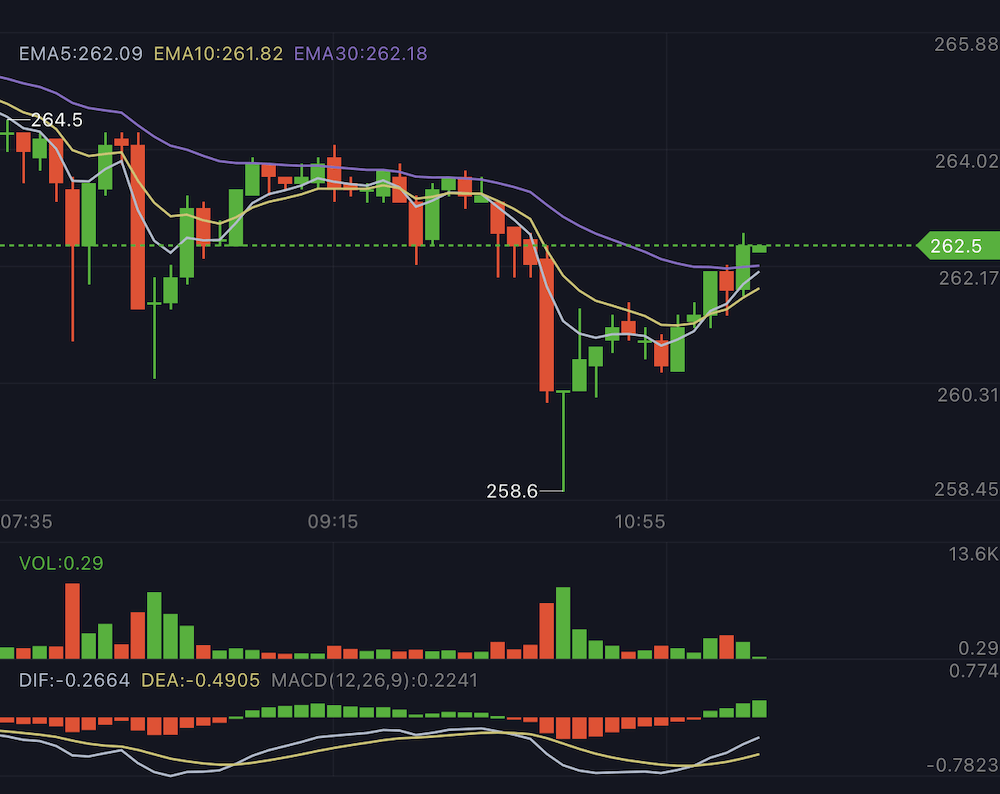

# Stockee

Highly customizable lightweight k-line chart written in swift.


## Installation

### Swift Package Manager

- File > Swift Packages > Add Package Dependency
- Add https://github.com/octree/Stockee.git
- Select "Up to Next Major" with "1.3.1"

### Cocoapods

```bash
pod 'Stockee'
```

## Docs
[中文文档](./README_CN.md)
### Sample

Use a declarative syntax to build your k-line chart like `SwiftUI`. It's simpler and easier to read.

```swift
chartView.descriptor = ChartDescriptor(spacing: 0) {
    ChartGroup(height: 200) {
        GridIndicator(lineWidth: 1 / UIScreen.main.scale, color: .Stockee.border)
        YAxisAnnotation()
        CandlestickChart()
        MAChart(configuration: .init(period: 5, color: .yellow))
        MAChart(configuration: .init(period: 10, color: .teal))
        MAChart(configuration: .init(period: 20, color: .purple))
    }

    ChartGroup(height: 18) {
        TimeAnnotation(dateFormat: "HH:mm")
        SelectedTimeIndicator()
    }
}
```

## License
**Stockee** is available under the MIT license. See the LICENSE file for more info.